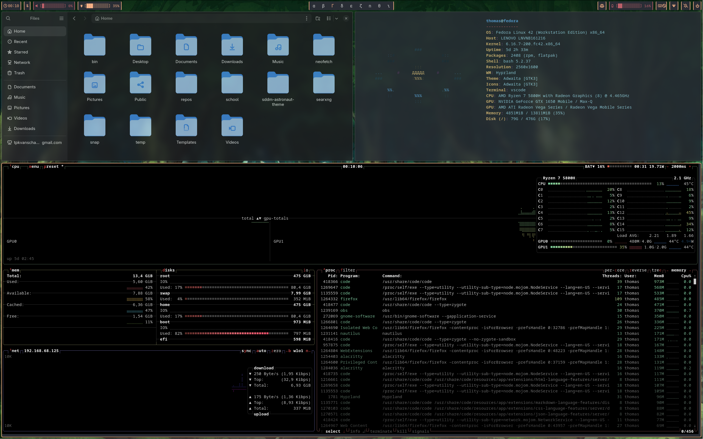
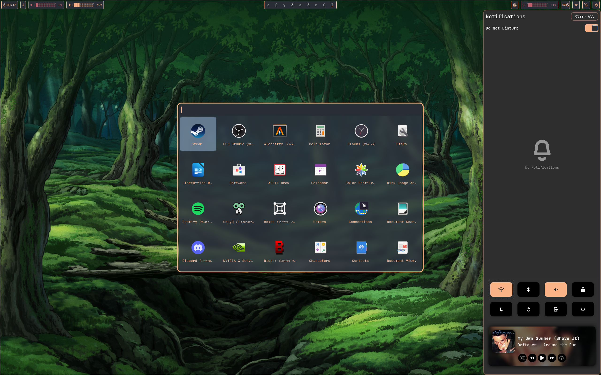

# dotfiles

My dotfiles using Hyprland on fedora. The theme and complete setup is heavily inspired by [pewdiepe](https://github.com/pewdiepie-archdaemon/dionysus/blob/dionysus/dotfiles/README.md) his setup. 

## Demo

### Main screen

### Notification deamon

